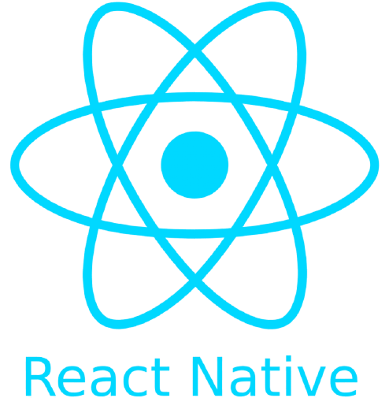

<!--  -->
## Hi there 👋

  

 

 

✨This is Muharrem ✨ I'm a full stack developer, interested in writing new codes, dreaming new designs and creating new web sites but my speciality is front-end developing.

You may find some projects on my repos, feel free to contribute or using them. 
“Share your knowledge. It is a way to achieve immortality.” (Dalai Lama) ⚡⚡⚡

- ✨ Languages: Javascript, Python
- ✨ Front-End Development:React, React Native,Javascript, HTML, CSS, JQuery
- ✨ Back-End Development: Node.js, MongoDB, Express, Django, MySQL
 

### Medium Articles

- [Installation of Django & Creating a Project](https://marntext.medium.com/installation-of-django-creating-a-project-cafeac454e58)

 
 

<!-- 
 
 &nbsp;&nbsp; &nbsp;&nbsp; 
 &nbsp;&nbsp;&nbsp;&nbsp; 
&nbsp;&nbsp; &nbsp;&nbsp; 
 &nbsp;&nbsp;&nbsp;&nbsp; 
&nbsp;&nbsp; &nbsp;&nbsp; 

 
 
    -->

